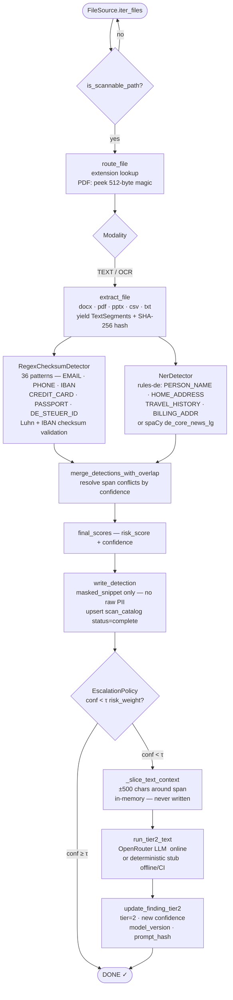
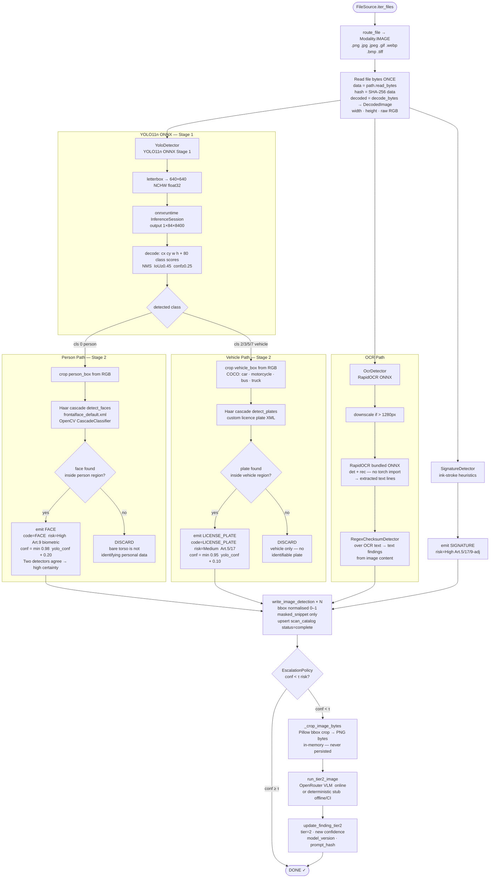
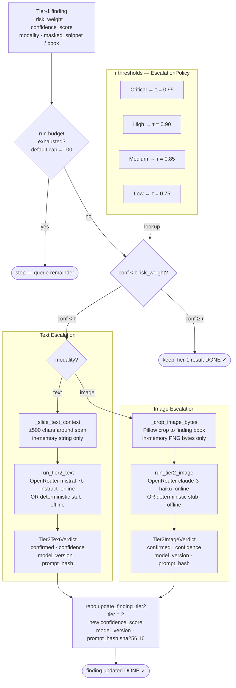

# Bosch GDPR Data-Discovery Engine — System Design

---

## Feature & Design Highlights

| # | Feature / Principle | Description |
|---|---|---|
| 1 | **Torch-free ONNX runtime** | YOLO11n and OCR run entirely via `onnxruntime` + `rapidocr_onnxruntime`. `torch`, `ultralytics`, and `easyocr` are **never imported at runtime** — only used at build time to export `.onnx` weights. Cold-start drops from ~25 s → ~3-5 s. |
| 2 | **Modality-first routing** | Every file is classified as `TEXT`, `IMAGE`, or `OCR` before scanning begins. PDFs are sniffed via magic-byte probe (`/Font` vs `/Image`). This routes each file to exactly the right detector chain with zero wasted work. |
| 3 | **Two-pass image GDPR detection** | YOLO stage-1 detects coarse COCO classes (person, vehicle). A Haar cascade stage-2 confirms **face** inside a person box and **licence plate** inside a vehicle box. A bare torso is never surfaced — both detectors must agree. |
| 4 | **Deterministic write order** | Detection runs concurrently (bounded `ThreadPoolExecutor`), but DB writes happen on the main thread in fixed discovery order. Finding IDs are byte-identical run-to-run — reproducibility is a first-class property. |
| 5 | **Risk-tiered Tier-2 escalation** | Only low-confidence Tier-1 findings are escalated. The confidence threshold τ is **risk-gated**: Critical → 0.95, High → 0.90, Medium → 0.85, Low → 0.75. A per-run budget cap prevents runaway API spend. |
| 6 | **Ephemeral context only** | Tier-2 LLM/VLM receives only an in-memory snippet or cropped image bbox — the raw content is never written to disk or persisted in the catalog. All PII leaves the system masked. |
| 7 | **Delta scan with Graph token** | OneDrive sources support Microsoft Graph delta-link protocol. Only changed/created/deleted items are re-scanned; the delta token is stored per drive in SQLite for resumability. |
| 8 | **Non-blocking async API** | `POST /scans` returns a `scan_id` immediately; the scan runs on a daemon thread. `GET /scans/{id}` streams `current_file` + `phase` so the React dashboard shows live progress without polling the file system. |
| 9 | **Single image decode** | Image bytes are read once, hashed once, decoded once (Pillow). The resulting `DecodedImage` (raw RGB, width, height) is passed to YOLO, OCR, and Signature detectors — no redundant I/O. |
| 10 | **Offline-safe CI** | Every external dependency (ONNX model, OpenRouter API) has a deterministic in-process fallback. CI never hits the network; tests are reproducible without model weights. |
| 11 | **GDPR classification taxonomy** | 36 classification codes (20 MVP) covering Art. 5/17 identifiers through Art. 9 special-category data (biometric, health, genetic). Risk weights drive UI severity colours and Tier-2 thresholds. |
| 12 | **Role-gated React UI** | Admin and Owner roles enforced via `RbacGuard`. Admins control scans; Owners see only their files' aggregated KPIs. Raw PII values are never sent to the browser — only masked snippets. |

---

## System Architecture

```mermaid
graph TD
    subgraph Browser["Browser  :5173  —  React 19 + Vite + Tailwind"]
        A[AdminPage / ScanLauncher / ScanProgress]
        B[KPI Dashboard / ClassificationBreakdown / ThroughputChart]
        C[RbacGuard — admin / owner]
    end

    subgraph API["FastAPI  :8000"]
        D[POST /scans]
        E[GET  /scans/{id}]
        F[GET  /aggregates]
        G[GET  /findings]
        H[POST /tier2/pass]
        I[GET  /capabilities]
    end

    subgraph Orch["ScanOrchestrator"]
        J[begin_scan — daemon thread]
        K[Modality Router]
        L[_DetectorPool — thread-local]
        M[ThreadPoolExecutor — bounded workers]
    end

    subgraph Sources["File Sources"]
        N[LocalFolderSource]
        O[OneDriveGraphSource — delta token]
        P[OneDriveLiveSource]
    end

    subgraph TextPipeline["Text Pipeline"]
        Q[TextExtractor — docx / pdf / pptx / csv / txt]
        R[RegexChecksumDetector — 36 patterns + Luhn/IBAN]
        S[NerDetector — rules-de or spaCy de_core_news_lg]
        T[merge_detections_with_overlap]
    end

    subgraph ImagePipeline["Image Pipeline"]
        U[decode_bytes — Pillow, once per file]
        V[YoloDetector — YOLO11n ONNX stage-1]
        W[CascadeDetector — Haar stage-2]
        X[OcrDetector — RapidOCR ONNX]
        Y[SignatureDetector]
    end

    subgraph Tier2["Tier-2 Escalation"]
        Z[EscalationPolicy — τ by risk weight]
        AA[run_tier2_text — OpenRouter LLM or offline stub]
        AB[run_tier2_image — OpenRouter VLM or offline stub]
    end

    subgraph DB["SQLite  WAL mode"]
        AC[(scan_catalog)]
        AD[(finding)]
        AE[(scan_run)]
    end

    A --> C
    B --> C
    C -- Vite proxy /api --> API

    D --> J
    E --> J
    F --> AC
    G --> AD
    H --> J
    I --> Orch

    J --> K
    K --> M
    M --> L
    L --> TextPipeline
    L --> ImagePipeline
    J --> Sources
    N --> J
    O --> J
    P --> J

    Q --> R
    Q --> S
    R --> T
    S --> T
    T --> AD

    U --> V
    V --> W
    U --> X
    U --> Y
    W --> AD
    X --> AD
    Y --> AD

    J --> Z
    Z --> AA
    Z --> AB
    AA --> AD
    AB --> AD

    J --> AC
    J --> AE
```

---

## Scan Flow 1 — Text File (Tier-1 → Tier-2)



---

## Scan Flow 2 — Image File — Double-Pass Person & Vehicle Detection



---

## Scan Flow 3 — Tier-1 → Tier-2 Escalation Policy



---

## Key Design Decisions

| Decision | Rationale |
|---|---|
| ONNX over PyTorch at runtime | Eliminates 16 s native-module cold-start on Windows; removes 2 GB torch wheel from production dependencies |
| Two-pass detection (YOLO → Haar) | Art. 9 applies to **biometric data**, not bodies. Face confirmation prevents false positives on background crowds, reducing owner alert fatigue |
| Separated detect / write phases | Concurrent detection + serial write = speed and deterministic finding IDs. Avoids SQLite write-lock contention under parallel workers |
| Ephemeral-only Tier-2 context | Context sent to LLM/VLM is never written to disk or stored in the DB. Satisfies GDPR data-minimisation for the tool itself |
| Delta token in SQLite | Persisting the Graph delta link means a restart resumes from the exact change cursor — no re-scan of unchanged files after a crash |
| Risk-tiered τ thresholds | Critical-risk PII (passport, credit card) requires near-certainty before bypassing Tier-2; Low-risk items tolerate more ambiguity, controlling API cost |
