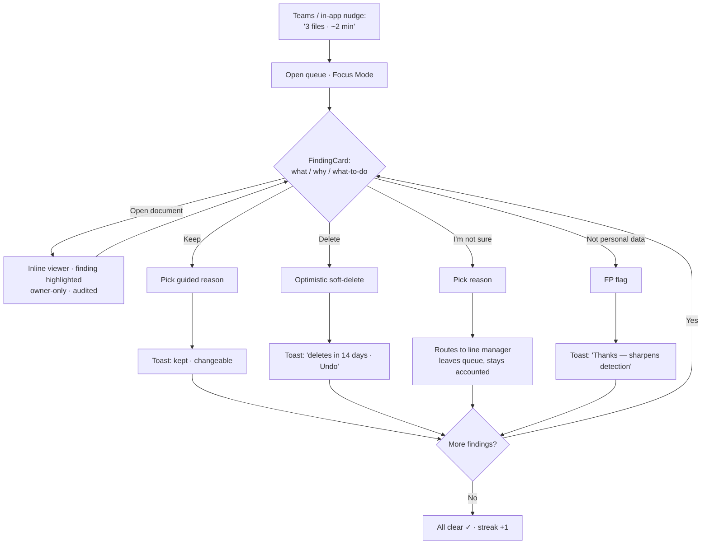
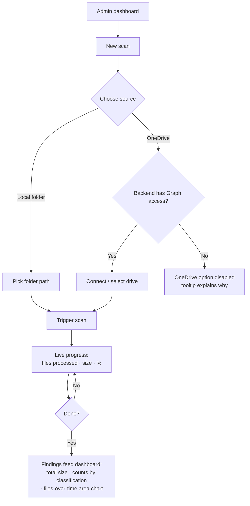

# UX Design Specification — Automated GDPR Compliance (Bosch Data Discovery)

**Author:** Vivek
**Date:** 2026-05-31

---

<!-- UX design content will be appended sequentially through collaborative workflow steps -->

## Executive Summary

### Project Vision

A Bosch-internal **GDPR accountability engine** presented as a calm, plain-language
remediation workflow. It converts an impossible centralized audit into thousands of
trivial, owner-level decisions — each file is either *justified-and-kept* or *safely
deleted*, with a reproducible, regulator-defensible record. The UX north star is
**"every personal-data file accounted for, in under a minute per finding, with zero
GDPR expertise required."**

### Target Users

- **Data Owner (Lena Vogt)** — primary surface. Busy engineer, no GDPR training.
  Reviews only her own findings, acts fast, never fears mistakes. Motivated, not policed.
- **Line Manager / Delegate (Markus Bauer)** — escalation inbox; acts on behalf for
  orphaned / departed-employee data. Partial in MVP (escalations land in a queue).
- **DPO / Admin (Dr. Anja Hofmann)** — aggregate oversight + scan control. Sees the
  picture and the proof, **never** individual PII (Art. 32 least-privilege; no break-glass).

### Key Design Challenges

1. **Motivate without trivializing** — gamify *accountability* (resolution, streaks,
   queue-to-zero), never deletion specifically, inside a legal/compliance context.
2. **Show enough to triage, load the real thing to decide** — masked snippet + location
   pointer in the queue for fast triage; one-click in-UI document viewer (owner-only,
   audited, fetched from the source file with the finding highlighted) for the actual
   keep/delete call. The findings store never persists raw PII.
3. **Frictionless yet defensible** — capture "why keep" (guided dropdown + optional
   one-tap detail) and false-positive feedback in a single tap, while keeping the audit
   trail solid.
4. **Two very different surfaces, one system** — a consumer-grade Owner view vs. a
   data-dense Admin control/analytics pane, sharing one component library under strict RBAC.

### Design Opportunities

1. **The "Inbox Zero" of compliance** — a ranked queue with progress framing that feels
   satisfying to clear ("3 of 47 done → all clear").
2. **Reward loop on correctness** — a one-tap "false positive" that visibly "teaches the
   system," turning a chore into a contribution that improves engine precision.
3. **Calm, confident tone** — plain verbs, reversible actions, consequence hints;
   competence, not blame.
4. **Admin as mission control** — trigger and scope scans, optionally connect OneDrive,
   watch throughput climb on a live time-series, see risk shrink.

## Core User Experience

### Defining Experience

The one interaction that defines the product is an owner **resolving a finding in under
60 seconds — with confidence and zero fear**. Everything else (scanning, scoring, routing)
is plumbing in service of that moment. Two core loops:

- **Owner — the Resolve loop:** notification → open ranked queue → read plain-language
  card → (optionally load the document) → act (keep / delete / escalate) or flag
  false-positive → progress toward "all clear."
- **Admin — the Mission-Control loop:** pick a folder (or connect OneDrive) → trigger
  scan → watch progress + throughput climb → read aggregates → see risk shrink over time.

### Platform Strategy

Internal enterprise **web app**, **desktop-only for MVP** (Bosch work laptops,
mouse/keyboard). No mobile/responsive target and no offline mode in MVP. **WCAG 2.1 AA**
(broad internal audience). Three RBAC-gated surfaces (Owner / Line-Manager / Admin) share
one component library. Notifications still reach owners via the in-app dashboard and a
Microsoft Teams message (per the PRD), but the Teams notification simply opens the
desktop web app — there is no separate mobile experience.

### Effortless Interactions

- **Automatic (zero user intervention):** ownership routing, silent risk-ranking of the
  queue, Teams + in-app notification, soft-delete scheduling, false-positive feedback
  piped to engine tuning.
- **One tap:** keep-with-reason (guided dropdown), delete (reversible), "I'm not sure"
  escalate, "not personal data" false-positive flag.
- **One click:** load the full document inline with the finding **pre-highlighted and
  scrolled into view**.

### Critical Success Moments

1. **First open** — *"3 files, ~2 minutes"*: a manageable nudge, not a scary alert.
2. **First delete** — *"Scheduled for deletion in 14 days — cancel anytime"*: the
   fear-removal moment.
3. **Queue-to-zero** — *"All clear"*: accomplishment + the gamification payoff.
4. **False-positive flag** — *"Thanks — this helps the system get smarter"*: a chore
   becomes a contribution.
5. **Admin first scan** — progress bar climbing + live throughput chart: mission-control
   confidence.

### Experience Principles

1. **Reversible by default** — no action is scary; delete is undo-able, keep is changeable.
2. **Plain language, zero jargon** — plain verbs, no article numbers, no "data subject."
3. **Rank silently, hide nothing** — risk orders the queue invisibly; confidence shows as
   "likely / not sure," never a percentage.
4. **Triage cheap, verify deep** — masked snippet to triage, load the real document to decide.
5. **Reward accountability, not deletion** — gamify resolution and correctness, never nudge
   toward deleting.
6. **Frictionless but defensible** — one tap to act, a solid audit trail underneath.
7. **Two surfaces, one system** — consumer-grade calm for owners; mission-control density
   for admins.

## Desired Emotional Response

Emotion is a **compliance lever** here, not decoration: the PRD's biggest behavioral risk
is "employee fear → keep everything." If the owner feels *calm and competent* she resolves
honestly and fast; if she feels *watched or blamed* she hoards files and the product fails.

### Primary Emotional Goals

- **Owner → "calm competence":** *"That was easy, I handled it, I'm not in trouble."*
- **Admin → "assured control":** *"Everything's being managed and I can prove it"* —
  oversight without overwhelm.

### Emotional Journey Mapping

| Moment | Should feel | Must not feel |
|---|---|---|
| Notification | Reassured — "small, ~2 min, manageable" | Alarmed, ambushed |
| Reading a finding | Confident — "I understand why, I know what to do" | Confused, judged |
| Acting (delete / keep) | Safe — "reversible, no risk" | Anxious, second-guessing |
| Queue-to-zero | Accomplished / proud — "all clear" | Indifferent |
| Mistaken delete | Relieved — "I can undo this" | Panicked |
| Flagging false-positive | Useful — "I improved the system" | Annoyed, unheard |
| Returning | Willing, mildly motivated (streak) | Dread |

### Micro-Emotions

Critical states to win: **Confidence > Confusion · Safety > Anxiety · Trust > Skepticism ·
Accomplishment > Frustration.** Emotions to design *out*: guilt ("you have a passport
number"), surveillance-anxiety ("Bosch is watching my files"), blame, and gamification that
feels gimmicky in a legal context.

### Design Implications

- **Calm / safe** → reversible actions + soft-delete grace period; supportive muted tone;
  **no red-alarm framing**; copy never blames.
- **Confident** → plain-language consequence hint + a clear recommended action + confidence
  as "likely / not sure."
- **Accomplished** → progress framing ("3 of 47"), a satisfying queue-to-zero moment,
  gentle streaks.
- **Useful / contributing** → explicit acknowledgment when a false-positive is flagged
  ("thanks — this sharpens detection").
- **Trust** → "why was this flagged?" transparency + visible reversibility.
- **Admin assurance** → live scan progress, a trend line that visibly *falls*, one-click
  exportable proof.

### Emotional Design Principles

1. **Calm over alarm** — supportive tone, never scare.
2. **Safety before speed** — reversibility removes the fear that drives hoarding.
3. **Credit, not blame** — celebrate accountability; never shame someone for holding PII.
4. **Tasteful gamification** — pride and contribution, appropriate to a legal context;
   never arcade gimmickry.
5. **Trust through transparency** — show why flagged and that every action is reversible.

## UX Pattern Analysis & Inspiration

### Inspiring Products Analysis

| Product | What it nails | Borrow for |
|---|---|---|
| **Superhuman / Gmail "Inbox Zero"** | Ranked queue, keyboard triage, a satisfying clear-to-zero | Owner queue + progress framing |
| **Gmail "Undo Send" / iOS delete-with-undo** | Destructive action made reversible by default | Soft-delete grace period; fear removal |
| **Duolingo (dialed down)** | Streaks & gentle momentum that pull users back | Tasteful gamification — adapted, not arcade |
| **Gmail "Report / Not spam"** | One tap that visibly teaches the system + a quiet thank-you | False-positive flag reward loop |
| **GitHub PR "Files changed" (inline highlight)** | Document shown with the relevant region highlighted, act in context | In-UI document viewer with finding highlighted |
| **Linear / Vercel dashboards** | Calm, fast, data-dense yet uncluttered; clean time-series | Admin mission-control + throughput area chart + craft |

### Transferable UX Patterns

- **Navigation:** a single prioritized **queue** as the home (not a file-browser tree);
  "Start here" focus mode; keyboard shortcuts for power users.
- **Interaction:** **act-then-undo** (optimistic, reversible) instead of confirm-modal-then-act;
  **inline highlight** in the document viewer; **one-tap feedback** with acknowledgment.
- **Visual:** muted/supportive palette, **risk encoded by order, not alarm-red**; progress
  rings / "x of y"; restrained motion for the queue-to-zero moment.

### Anti-Patterns to Avoid

- **Legacy GRC / compliance dread** (SAP GRC, Varonis console) — dense jargon, scary red,
  admin-centric. We are the opposite.
- **Cookie-consent dark patterns / guilt framing** — never shame "you have a passport number."
- **Raw confidence percentages / risk numbers** — forbidden by the PRD; show "likely / not sure."
- **Arcade gamification** — confetti spam, trivializing badges in a legal context.
- **Surveillance vibes** — "we scanned all 8,000 of your files" reads as Big Brother; frame
  around the few that need attention.
- **Scary confirm-modals on delete** — they induce the exact hoarding we are fighting; use
  reversible soft-delete instead.
- **Bulk raw-PII exposure** in the list view.

### Design Inspiration Strategy

- **Adopt:** Inbox-Zero queue + clear-to-zero satisfaction; act-then-undo soft-delete;
  "Report / Not spam"-style FP feedback with acknowledgment; Linear/Vercel-grade clean
  time-series for admin.
- **Adapt:** Duolingo streaks → quiet accountability momentum (no mascots, no confetti
  storms); GitHub inline highlight → owner-only, audited document viewer.
- **Avoid:** every legacy-compliance and dark-pattern reflex listed above.

## Design System Foundation

### 1.1 Design System Choice

**React + Vite + TypeScript** (per the locked architecture) · **Tailwind CSS** ·
**shadcn/ui (Radix primitives)** · **Recharts** for charts. A *themeable* system — proven
accessible primitives with full visual control — chosen over a custom system (too slow for
48h) and over batteries-included kits like MUI/Ant (whose opinionated look fights our calm,
bespoke aesthetic).

### Rationale for Selection

- **shadcn/ui = Radix + Tailwind, copy-in components** (not a heavyweight dependency) — we
  own the code, so the calm/supportive aesthetic is achievable without fighting a vendor
  theme (the Linear/Vercel craft from our inspiration analysis).
- **Radix primitives provide WCAG 2.1 AA mechanics** for free — focus management, ARIA,
  keyboard navigation (needed for keyboard-driven triage). Accessibility is a PRD NFR.
- **Tailwind design tokens (CSS variables)** encode risk-by-order-not-alarm-color, a muted
  palette, and one shared theme across Owner + Admin ("two surfaces, one system").
- **Recharts** handles the Admin throughput area chart and enum aggregations cleanly and
  lightweightly; themeable to match. (Tremor is a faster-to-assemble fallback if Admin
  polish is time-boxed.)
- **One dev, one library:** components built once, role-gated across the three route trees.

### Implementation Approach

Scaffold React-TS in the existing `web/`; add Tailwind + shadcn/ui; define a **token layer
first** (color / spacing / typography / radii as CSS variables) so Owner and Admin share one
theme; build a small **shared component library** (`web/src/components/`) — FindingCard,
ActionBar, Queue, Snippet, DocumentViewer, KpiTile, ThroughputChart — consumed by all three
RBAC views.

### Customization Strategy

Muted, supportive palette (no alarm-red as the primary signal); risk communicated through
**queue order + subtle weight**, never a number; confidence as a worded chip
("Likely" / "Not sure"); restrained motion reserved for the queue-to-zero moment; dark mode
deferred to post-MVP.

## Defining Interaction — "Resolve a Finding"

**In one line (what Lena tells a colleague):** *"It's like Inbox Zero, but for personal
data — a short list pops up, each card tells me plainly what's in the file and what to do,
and I clear it in a minute."*

### 2.1 Defining Experience

The product lives or dies on the **finding card + act** loop: read one calm card →
understand *what / why / what-to-do* → Keep / Delete / Escalate / "Not personal data" →
card slides away, progress ticks → "All clear." Nail this and scanning, scoring, and routing
are all just plumbing behind it.

### 2.2 User Mental Model

Users map this to **email / notification triage**, not compliance. They bring "I've got a
few items, let me knock them out," and zero GDPR vocabulary; today their "solution" is
ignoring scary IT emails. Expectation: a *short* list, an obvious action per item, fast, and
— critically — *safe to act* without fear of breaking something. Confusion risk: if a card
reads like legal text or a delete feels irreversible, they freeze and hoard.

### 2.3 Success Criteria

- A finding resolved in **< 60s** with no outside help (NFR19).
- The card answers what / why / what-to-do **without the user thinking**.
- Every action feels **reversible and safe** (no dread).
- Progress is always visible ("3 of 47"); **queue-to-zero** delivers a real payoff.
- Flagging a false-positive feels like **contributing**, not complaining.

### 2.4 Novel UX Patterns

Deliberately **established patterns in a novel combination** — low learning curve.
Borrowed-and-familiar: email-style queue, card stack, act-then-**undo toast**,
"Report / Not spam" feedback. The novel twist (the part that is ours): a card that fuses
**silently-ranked risk + worded confidence + a plain consequence hint + FP-as-contribution**,
so a legal decision feels like clearing an inbox. The familiar metaphor carries the novelty.

### 2.5 Experience Mechanics

1. **Initiation** — Teams / in-app nudge: *"3 files may contain personal data — ~2 min."*
   Opening lands on the queue with **"Start here"** focused on the top item (highest risk,
   ordered silently).
2. **Interaction** — the **FindingCard** shows: file name + type icon · plain classification
   (*"This file contains a passport number"*) · confidence chip (*"Likely"*) · one-line
   consequence hint · **masked snippet + "Open document"** (loads inline, finding
   pre-highlighted, owner-only + audited). **ActionBar:** **Keep** → guided reason dropdown ·
   **Delete** → optimistic soft-delete · **I'm not sure** → escalate + reason · secondary
   **"Not personal data"** → false-positive flag. Keyboard shortcuts (K / D / E / F).
3. **Feedback** — act-then-undo toast (*"Scheduled for deletion in 14 days — Undo"*); card
   animates out; progress advances; FP flag → *"Thanks — this sharpens detection."* Mistakes
   are always one tap to reverse.
4. **Completion** — queue empties → restrained **"All clear ✓"** moment + streak increment;
   nothing left demanding attention until the next delta scan.

## Visual Design Foundation

No brand constraints (custom neutral palette) — tuned to the "calm competence" emotional
goal. Values below are starting tokens, refined in design directions.

### Color System

| Token | Value (start) | Use |
|---|---|---|
| `neutral` 50→900 | slate ramp (`#F8FAFC` → `#0F172A`) | backgrounds, text, borders — the dominant tone |
| `primary` | calm indigo `#4F6BED` | primary actions, focus rings, links — "trust," not alarm |
| `success` | muted green `#2E7D5B` | "All clear," kept-safely confirmations |
| `caution` | amber `#B7791F` | sparingly — grace-period countdown, escalation pending |
| `destructive` | muted clay `#B05A4A` | the Delete action — **deliberately not bright red** |
| true-red | `#D64545` | reserved for genuine irreversible errors only (rare) |

**Risk is encoded by queue order + a subtle single-hue intensity ramp on a card's left edge
— never a red/green danger scale.** Confidence is a worded chip ("Likely" / "Not sure"),
never a color or percentage. Color is never the only signal — always paired with icon + label.

### Typography System

- **Inter** (variable) for all UI — clean, neutral, highly legible, open-source.
- **Monospace** (`ui-monospace` / JetBrains Mono) for masked snippets, IBANs, IDs, so
  `•••••4521` reads as data.
- Type scale: 12 / 14 / **16 (body)** / 20 / 24 / 30; body line-height 1.5, headings 1.25.
  Generous sizing supports the non-expert audience.

### Spacing & Layout Foundation

- **8px base grid** (4px half-steps); tokens 4 / 8 / 12 / 16 / 24 / 32 / 48.
- **Owner view = airy** — single-column focus, generous card padding, max content width
  ~720px (readable line lengths), one-thing-at-a-time calm.
- **Admin view = denser** — 12-column grid, compact KPI tiles + charts, full width
  (mission-control efficiency).

### Accessibility Considerations

- WCAG 2.1 AA: text contrast ≥ 4.5:1, large text / UI elements ≥ 3:1.
- **Never color-only** — every status pairs color with an icon and a text label.
- Visible focus rings (primary indigo) on all interactive elements; full keyboard operability
  (K / D / E / F shortcuts).
- Respect `prefers-reduced-motion` (queue-to-zero animation degrades to a static state).
- Minimum 14–16px body text; no information conveyed by hover alone.

## Design Direction Decision

Interactive mockups for the Owner "Resolve a Finding" experience are in
`_bmad-output/ux-design-directions.html` (5 directions on the same calm tokens).

### Design Directions Explored

- **A — Focus Mode:** one centred card at a time; maximum calm; keyboard-first.
- **B — List + Detail:** two-pane email-client layout; overview + inline document together.
- **C — Card Stack:** swipe-to-clear; most game-like momentum.
- **D — Compact Triage:** dense rows with inline actions; fastest for many findings.
- **E — Guided Wizard:** one big decision per screen; gentlest, most hand-holding.

### Chosen Direction

**A (Focus Mode) as the spine + D (Compact Triage) as an optional "list view" toggle.**
Focus Mode is the default; a toggle switches the same queue to the dense Compact Triage list.
Both reuse one set of atoms (FindingCard, ActionBar, confidence chip, masked snippet) and the
inline document viewer borrowed from B. Card-stack swipe (C) is deferred to post-MVP as a
delight layer; the Guided Wizard (E) is the fallback if usability testing surfaces anxiety.

### Design Rationale

- **Focus Mode delivers the defining experience** — "one calm card, < 60s, no fear" — for the
  typical owner with a handful of findings (the common case).
- **Compact Triage covers the power user** with many findings without a second design language.
- **One component set, two layouts** keeps build cost low (one frontend dev) and guarantees
  visual consistency under the "two surfaces, one system" principle.
- Swipe and Wizard are held in reserve so we ship the calm default first and add delight or
  extra hand-holding only if evidence calls for it.

### Implementation Approach

Build the shared atoms once (`FindingCard`, `ActionBar`, `ConfidenceChip`, `Snippet`,
`DocumentViewer`); render them in a **FocusView** (single card) and a **ListView** (Compact
Triage rows) behind a view toggle on the Owner queue. The Admin surface adopts the same tokens
and atoms at higher density. Swipe gestures and the Wizard flow are explicitly out of MVP scope.

## User Journey Flows

### Journey 1 — Owner: Resolve the queue (the core loop)

### Journey 2 — Admin: Run a scan

### Journey Patterns

- **Notification → single queue entry** (never a file tree).
- **Act-then-undo** everywhere a state changes (no scary confirm modals).
- **Guided reason capture** on Keep and Escalate (dropdown + optional detail).
- **"Leaves my queue but stays accounted"** — escalation never deletes the obligation.
- **Always-visible progress** ("3 of 47" / live scan %).
- **Conditional capability** — OneDrive is gated by backend Graph access and shown *disabled
  with a reason* rather than hidden (predictable).

### Flow Optimization Principles

- **Minimize steps to value** — the nudge lands directly on the first card; a scan starts in
  ≤ 2 clicks.
- **Reduce cognitive load** — one decision per card; the recommended action is implied by the
  consequence hint.
- **Reversible recovery** — Undo on delete; Keep is changeable; a mis-escalation can be
  reclaimed by the manager.
- **Edge cases handled gracefully** — empty queue ("nothing needs you 🎉"), empty/unreadable
  folder, OneDrive unavailable, departed-employee file → escalate path.
- **Delight at completion** — a restrained queue-to-zero moment + streak; the admin sees the
  throughput line climb.

## Component Strategy

### Design System Components

From **shadcn/ui + Radix** (themed via our tokens, WCAG-friendly): Button, Select/Dropdown,
Dialog, **Toast (Sonner)** for the undo pattern, Tooltip, Tabs (Focus ↔ List toggle), Badge,
Card, Progress, Table, Skeleton, Avatar, Switch, Popover. These cover ~60% of UI plumbing.

### Custom Components

| Component | Purpose | Key states / notes | Accessibility |
|---|---|---|---|
| **FindingCard** ★ | The hero — what / why / what-to-do for one finding | default · focused · acting (optimistic) · undone | `role=article`, aria-label = plain classification; K/D/E/F |
| **ActionBar** ★ | Keep / Delete / Escalate / "Not personal data" | default · loading · disabled | labelled buttons + `aria-keyshortcuts` |
| **ConfidenceChip** | Worded certainty ("Likely" / "Not sure") | likely · unsure · sensitive | text + icon, never color-only |
| **MaskedSnippet** | Mono masked value + "Open document" | masked (default) · copy-disabled | aria-label "passport number, masked" |
| **ReasonPicker** ★ | Low-friction "why keep" — guided dropdown + optional detail | collapsed · expanded | listbox semantics |
| **DocumentViewer** | Inline file with finding highlighted; owner-only, audited | loading · rendered · **unsupported → location-pointer fallback** | focus-trapped panel, ESC closes |
| **QueueProgress / AllClear** | "3 of 47" ring; queue-to-zero moment | progressing · all-clear · streak | `aria-live=polite` |
| **ScanLauncher + SourcePicker** | Admin: folder pick / **OneDrive connect (disabled w/ reason if no Graph access)** | idle · folder-chosen · onedrive available/disabled | disabled state announced |
| **ScanProgress** | Live files / size / % during a scan | running · done · error-retry | `aria-live` updates |
| **KpiTile** | Admin metric (total size, files, findings) | value · trend · loading | — |
| **ThroughputChart** | **Files-processed-over-time area chart** (Recharts) | empty · populated | table fallback for screen readers |
| **ClassificationBreakdown** | Admin aggregation by classification enum | — | — |
| **EscalationInbox row** | Line-manager queue (partial MVP) | open · acted | — |

### Component Implementation Strategy

Build every custom component from **Tailwind tokens + Radix primitives** so they inherit
accessibility and theme automatically. The Owner **FocusView** and **ListView** (Compact
Triage) are two *layouts* over the **same atoms** (FindingCard, ActionBar, ConfidenceChip,
MaskedSnippet) — no duplicated logic. Admin reuses the same tokens/atoms at higher density.
Charting is isolated in `ThroughputChart` / `ClassificationBreakdown` so Recharts is the only
charting dependency.

### Implementation Roadmap

- **Phase 1 — core owner slice (never cut):** FindingCard, ActionBar, ConfidenceChip,
  MaskedSnippet, ReasonPicker, Toast/undo, QueueProgress → one finding → one reversible action.
- **Phase 2 — verify + admin:** DocumentViewer, FP-flag handling, ScanLauncher + SourcePicker,
  ScanProgress, KpiTile, ThroughputChart, ClassificationBreakdown.
- **Phase 3 — delight + breadth:** AllClear / StreakBadge animation, Compact-Triage ListView
  toggle, EscalationInbox, OneDrive connect.

## UX Consistency Patterns

### Button Hierarchy

- **One primary action per view.** Owner card: **Keep** = solid dark-neutral (the "more effort"
  nudge); **Delete** = clay *outline* (deliberately not filled red); **Escalate** = neutral
  outline; **"Not personal data"** = ghost/tertiary. Admin primary = indigo (Trigger scan).
- **Destructive ≠ alarm.** Delete is outline-clay + reversible — never a filled-red high-alarm
  button.
- Buttons carry a keyboard-shortcut hint (`K / D / E / F`) and an optimistic `loading` state.

### Feedback Patterns

- **Act-then-undo Toast (Sonner)** is the default for every state change — *"Scheduled for
  deletion in 14 days — Undo,"* auto-dismiss ~8s. **No blocking confirm modals** (soft-delete
  makes them unnecessary).
- **Acknowledgment toast** on false-positive: *"Thanks — this sharpens detection."*
- **Errors are inline + retryable**, never a dead-end.
- **Confidence** = worded chip ("Likely" / "Not sure"); **risk** is never a number or alarm
  color — only queue order + a quiet edge.
- **Progress** uses `aria-live=polite` (queue "3 of 47"; scan %).

### Form Patterns

- **Guided-first input.** ReasonPicker = dropdown of common reasons (one tap); free text hidden
  behind "Add detail" (optional) — defensible yet low-friction.
- **Inline, non-blocking validation**; minimum fields; never block the primary action on
  optional detail.
- Source config: folder path / OneDrive connect — **conditional fields disabled with a reason**,
  not hidden.

### Navigation Patterns

- **A single prioritized queue is the home** per role (no file tree). Role-gated route trees
  (Owner / Line-Manager / Admin) share one shell.
- **Focus ↔ List toggle** on the Owner queue; Admin uses a left-nav (Dashboard · Scans).
- Shallow by design — at most queue → opened document; back is always one step.

### Additional Patterns

- **Empty/clear states are celebratory** — Owner: *"All clear 🎉 nothing needs you"*; Admin:
  *"No scans yet — start one."*
- **Loading** = skeleton cards / tiles (no spinners on blank).
- **Masking is global** — PII masked in every list; unmasked **only** inside the owner-opened,
  audited DocumentViewer.
- **Motion is restrained** and honors `prefers-reduced-motion`.
- **Conditional capability** pattern (OneDrive) reused anywhere backend access gates a feature:
  visible-but-disabled + tooltip.

## Responsive & Accessibility Strategy (condensed)

> Steps 13–14 condensed for the 48-hour hackathon. Accessibility was specified in detail in the
> Visual Design Foundation; responsive design is intentionally out of MVP scope.

- **Responsive:** **desktop-web only** for MVP (Bosch work laptops). No mobile/tablet layout; the
  Admin analytics pane is desktop-only by design. Mobile is a post-MVP consideration.
- **Accessibility (WCAG 2.1 AA — a PRD NFR):** text contrast ≥ 4.5:1 / UI ≥ 3:1; status never
  conveyed by color alone (color + icon + label); visible focus rings; full keyboard operability
  incl. K/D/E/F shortcuts; `aria-live` for queue/scan progress; `prefers-reduced-motion` honored;
  14–16px minimum body text; Radix primitives supply focus management and ARIA.
- **Plain-language mandate** (NFR17): every UI string passes a "no GDPR jargon" check.

---

*UX Design Specification complete (2026-05-31). Companion mockups:
`_bmad-output/ux-design-directions.html`.*
